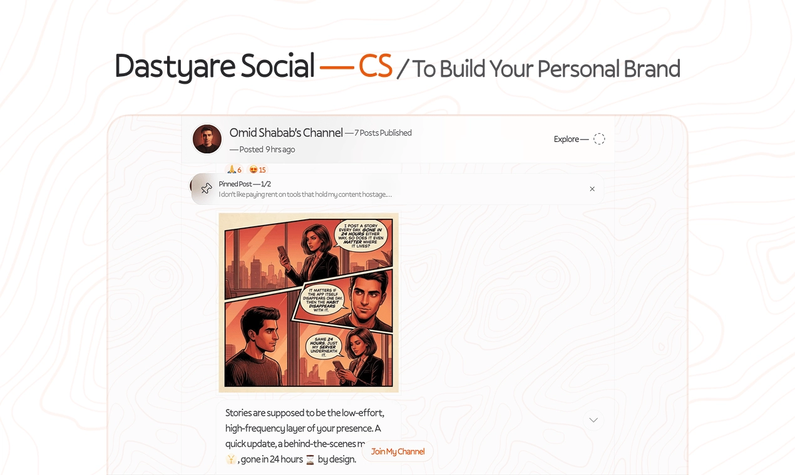
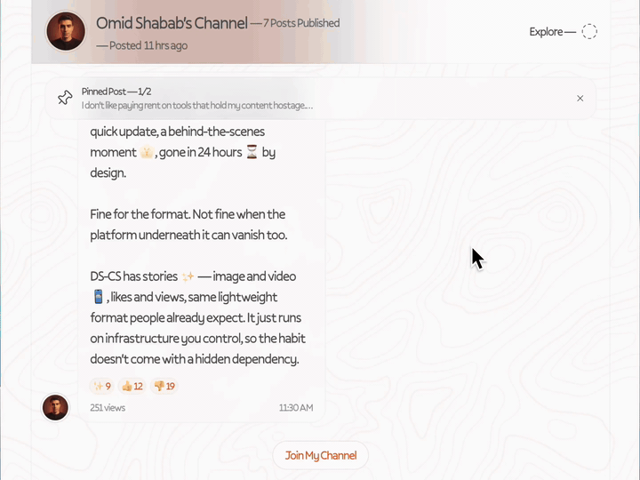
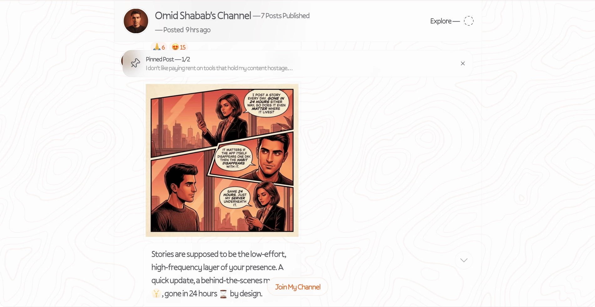
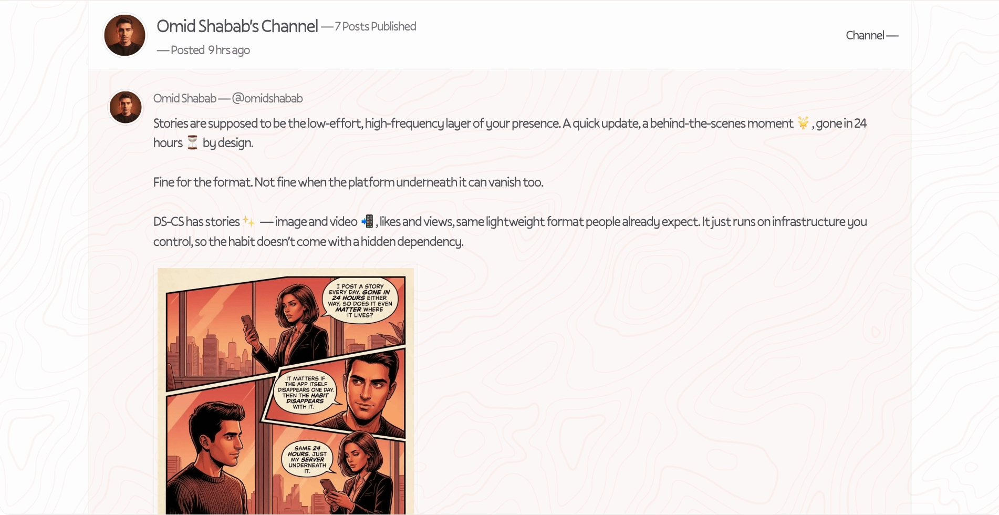
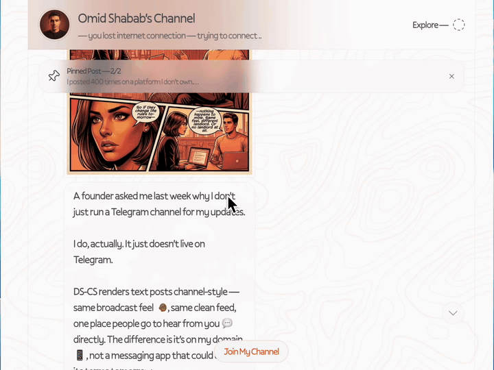
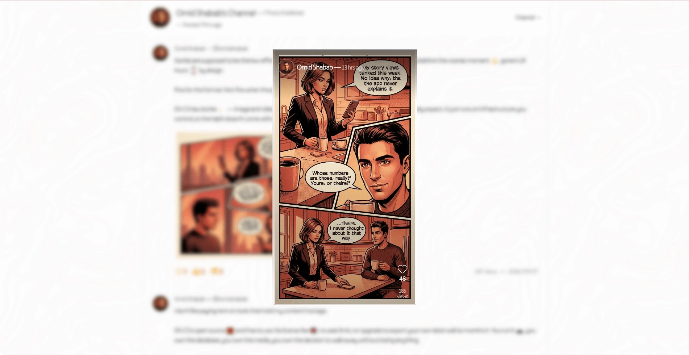
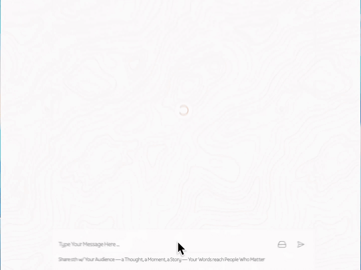
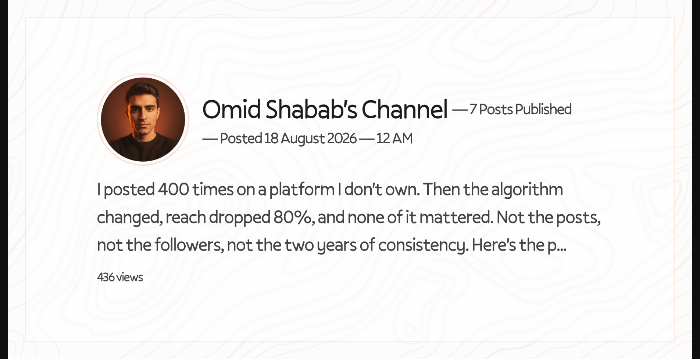

<p align="center">
  
</p>

<h1 align="center">Dastyare Social — CS</h1>

<p align="center">
  Get free of the Algorithm. Focus on Getting Leads and Making More Money.
</p>

<p align="center">
  <a href="#getting-started">Get Started</a> · <a href="#self-hosting">Self-Host</a> · <a href="#api">API</a> · <a href="https://github.com/dastyare-social/DS-CS">View on GitHub</a> · <a href="./docs/posthog-dashboard-guide.md">Analytics</a>
</p>

<p align="center">
  <a href="https://github.com/dastyare-social/DS-CS/blob/main/LICENSE">
    
  </a>
  <a href="https://github.com/dastyare-social/DS-CS/stargazers">
    
  </a>
  <a href="https://github.com/dastyare-social/DS-CS/network/members">
    
  </a>
  <a href="https://github.com/dastyare-social/DS-CS/issues">
    
  </a>
</p>

<p align="center">
  
  
  
  
  
  
  
  
  
  
</p>

---

Every post you publish should work for you — not pad someone else's engagement numbers. DS-CS puts your content where real buyers and search engines actually find it, answering to you, not a feed algorithm.

> [!WARNING] > **SEO & LLM discovery is experimental.** DS-CS follows current best practices (sitemap, robots.txt, `llms.txt`, structured data, MCP), but search engines and AI assistants may index, rank, cite, or surface your content unpredictably — or not at all. Don't treat discovery as a guarantee.

- Get found by the people actually looking for what you do — not buried by an algorithm's mood swings
- Nothing you post can be taken down, demonetized, or buried by a policy change overnight
- Every post keeps working for you long after it's published — indexed, searchable, and referenceable, not gone in a day

---

## Demo

<p align="center">
  
</p>

> **[Try the live demo →](https://cs.dastyare.social)**
>
> See how the creator studio feels before you deploy it yourself.

---

## Pages

| Route                  | Description                                                                                                                                                                                                                                     |
| ---------------------- | ----------------------------------------------------------------------------------------------------------------------------------------------------------------------------------------------------------------------------------------------- |
| **`/`**                | **Home feed** — chronological post feed with infinite scroll, pinned post bar that cycles through pinned content, story avatar in the header, and a "Join My Channel" newsletter CTA at the bottom.                                             |
| **`/os`**              | **Creator studio** — authenticated admin panel. Same feed but with full CRUD: create text/image/video/voice/file posts, edit, delete, pin/unpin, and upload media via presigned S3 URLs. Rich textarea composer with media attachment previews. |
| **`/os/register`**     | **Login** — two-step email/password sign-in via Better Auth. Email first, password fades in.                                                                                                                                                    |
| **`/explore`**         | **Explore** — dual-pane TikTok-style content explorer. Left: Shorts (vertical fullscreen video feed with double-tap like). Right: Threads (horizontal text+image/video feed with reactions). Auto-polls for new threads every 30s.              |
| **`/posts/[post_id]`** | **Single post** — permalink page for sharing individual posts. Tracks views, includes SEO ArticleSchema structured data, and generates a dynamic OG image for social media previews.                                                            |
| **`/about`**          | **About / Resume** — driven entirely by `config/about.config.yml`. Toggle on/off without rebuild. Shows profile, experience, education, and contact sections.                                                                                     |
| **`/docs`**            | **API reference** — interactive Scalar UI for the REST API.                                                                                                                                                                                     |
| **`/sitemap.xml`**     | **Sitemap** — dynamic XML sitemap including all published posts.                                                                                                                                                                                |
| **`/robots.txt`**      | **Robots** — allows public routes, blocks `/os/` and `/api/`.                                                                                                                                                                                   |
| **`/llms.txt`**        | **AI agent map** — structured content map for language models and crawlers.                                                                                                                                                                     |

### Screenshots

#### Home page

<p align="center">
  
</p>

#### Explore page

<p align="center">
  
</p>

---

## Components

### Post Context Menu

<p align="center">
  
</p>

A fully custom-built right-click / long-press context menu — zero dependencies, built with React Context, Portals, and pointer event tracking.

- **Right-click** (desktop) or **long-press** (mobile, 500ms hold) on any post opens a floating menu
- **Emoji reaction bar** floats above the menu — tap any emoji to react instantly
- **Menu items** adapt to context: public feed shows "Copy Post Link"; admin panel adds Pin, Edit, Delete, Copy Text, and retry for failed posts
- Submenus, checkboxes, radio groups, and separators are built into the primitive system for extensibility

### Stories

<p align="center">
  
</p>

Ephemeral image and video stories with a native-feeling viewer — not a horizontal avatar bar, but a full-screen vertical reel.

- **Story viewer** opens as a 9:16 dialog with progress bars at the top (one per story, filling as it plays)
- **Image stories**: 5-second fixed duration with `requestAnimationFrame` progress tracking
- **Video stories**: progress driven by `onTimeUpdate`, auto-advances on end
- **Navigation**: tap left/right halves of screen, or let it auto-advance
- **Likes & views**: optimistic UI updates, heart button with count, view tracking per story
- **Admin controls**: ellipsis menu with delete (confirm dialog) when logged in on `/os`
- **Pre-load delay**: 500ms buffer before rendering media to prevent flash

### Add Story Modal

<p align="center">
  
</p>

Two-stage upload flow: file selection → 9:16 preview → direct-to-S3 upload → story creation.

- **File selection**: native file input with `capture="environment"` for camera, aspect ratio validation (landscape/near-square rejected)
- **Preview**: full-screen 9:16 dialog, videos auto-play with sound
- **Upload**: direct browser-to-S3 via presigned URLs — no server round-trip for the file itself. Circular progress ring with percentage
- **State machine**: `idle` → `uploading` → `creating` → `done` (auto-closes after 2s) or `failed` (retry button)
- **Cancel protection**: warns before closing during active upload, aborts the in-flight request
- **StoryPreviewModal**: alternative flow with dashed upload area, Change/Publish buttons, and local blob URL preview during upload

### Dynamic OG Images

<p align="center">
  
</p>

Every post gets a server-generated social media preview image — 2400×1260 PNG composed on-the-fly with `takumi-js`.

- **Layout**: profile picture (325×325 circle) + channel name + publish date + post content (truncated to 200 chars) + view count + media type label
- **Background**: textured `bg-image.png` with semi-transparent white overlay and subtle amber border
- **Font**: Pally Regular loaded from disk
- **Caching**: `Cache-Control: public, max-age=3600, s-maxage=3600, stale-while-revalidate=86400`
- **Endpoint**: `GET /api/og/posts/[postId]` — accessible to social media crawlers, explicitly allowed in `robots.txt`

---

## The Problem

Post on a platform you don't own, and the reach you build isn't really yours — one algorithm update, policy change, or suspension away from zero, no matter how good the content was.

DS-CS keeps that reach working for you instead: your content stays discoverable, stays yours, and keeps bringing people to your business on its own terms — not whenever a feed decides to show it.

---

## What You Get

| Feature                     | What it does                                                                                         |
| --------------------------- | ---------------------------------------------------------------------------------------------------- |
| **Multi-format posts**      | Text, image, video, voice, or file — each published in the format that reads best.                   |
| **Shorts (vertical video)** | TikTok/Reels-style vertical video feed built in.                                                     |
| **Stories**                 | Ephemeral image and video stories with view/like tracking.                                           |
| **Post context menu**       | Custom right-click/long-press menu with emoji reactions, pin, edit, delete.                          |
| **Dynamic OG images**       | Server-generated 2400×1260 social preview for every post.                                            |
| **Explore page**            | Dual-pane Shorts + Threads explorer with auto-polling.                                               |
| **Creator studio**          | Full CRUD admin panel with rich composer and presigned S3 uploads.                                   |
| **AI-ready content**        | Every post indexed for search engines, structured for AI agents, `llms.txt` sitemap included.        |
| **MCP server**              | AI agents can call posts and stories as tools via `/api/mcp`. [Setup guide →](./docs/mcp-guide.md)   |
| **Push notifications**      | Browser push notifications to subscribers when you publish.                                          |
| **SEO built in**            | Sitemap, robots.txt, OpenGraph images, structured data (JSON-LD), Google Search Console integration. |
| **Animated emoji**          | Optional animated .webp emoji overlays from the Telegram emoji set.                                  |
| **Admin bootstrap**         | First user created automatically from environment variables.                                         |
| **REST API + tRPC**         | Full API for headless publishing; tRPC for the internal dashboard.                                   |
| **Self-hosted**             | Your server, your database, your data. No third parties.                                             |
| **Docker-ready**            | Multi-stage build, Docker Compose included, one-command deploy.                                      |
| **Modern stack**            | Next.js 16, React 19, TypeScript, Bun, PostgreSQL, Drizzle ORM, Tailwind CSS.                        |

---

## Nothing Hidden

DS-CS is genuinely open-source — no license fee, no paid tier hiding the functionality you actually need. Inspect the code, self-host it, modify it, and never wonder if the free version is secretly the limited one. It's the one piece of the Dastyare Social suite built fully open, on purpose.

---

## Getting Started

Two options — pick one. Both use the prebuilt `dastyaresocial/ds-cs` image and bundle PostgreSQL + an S3-compatible object store.

### Option A — One-command install (recommended)

```bash
curl -fsSL https://raw.githubusercontent.com/dastyare-social/DS-CS/main/scripts/install.sh | bash
```

This downloads `docker-compose.yml`, generates a `.env` with sensible defaults, and starts the stack.

### Option B — Manual Docker Compose

```bash
curl -fsSL https://raw.githubusercontent.com/dastyare-social/DS-CS/main/docker-compose.yml -o docker-compose.yml
cp .env.example .env   # edit with your values
docker compose up -d
```

Migrations run automatically on first start, and an admin user is bootstrapped from your `.env` values.

### Start publishing

Open [http://localhost:8729](http://localhost:8729) and sign in with the admin credentials from your `.env`.

Post through the UI or the REST API directly — built for both from day one.

### Profile Image

Drop your photo at `public/profile-image.png` — with that exact name — and nothing else is required. On every build the project automatically center-crops it to a square, rounds it for the favicon and app icon, and generates the other images it needs (browser-tab icon, Apple/Android home-screen icons, PWA manifest icons). In-app avatars are rounded automatically too. A square image is ideal, but any aspect ratio works — it gets center-cropped. The build fails if the file is missing.

---

## API

Every feature in the dashboard is also available through the REST API. Protect your endpoints with a Bearer token.

### Endpoints

| Method   | Endpoint            | Description             |
| -------- | ------------------- | ----------------------- |
| `GET`    | `/api/posts`        | List posts              |
| `POST`   | `/api/posts`        | Create a post           |
| `GET`    | `/api/posts/{id}`   | Get a post by ID        |
| `PATCH`  | `/api/posts/{id}`   | Update a post           |
| `DELETE` | `/api/posts/{id}`   | Delete a post           |
| `POST`   | `/api/posts/{id}`   | Actions: reaction, view |
| `GET`    | `/api/stories`      | List stories            |
| `POST`   | `/api/stories`      | Create a story          |
| `GET`    | `/api/stories/{id}` | Get a story by ID       |
| `PATCH`  | `/api/stories/{id}` | Update a story          |
| `DELETE` | `/api/stories/{id}` | Delete a story          |
| `GET`    | `/api/webhooks`     | List webhooks           |
| `POST`   | `/api/webhooks`     | Create a webhook        |
| `GET`    | `/api/webhooks/{id}`| Get a webhook by ID     |
| `PATCH`  | `/api/webhooks/{id}`| Update a webhook        |
| `DELETE` | `/api/webhooks/{id}`| Delete a webhook        |

### Example

```bash
# Create a text post
curl -X POST https://app.dastyare.social/api/posts \
  -H "Authorization: Bearer YOUR_API_KEY" \
  -H "Content-Type: application/json" \
  -d '{"type": "text", "content": "Hello from the API!"}'

# Create a post with media
curl -X POST https://app.dastyare.social/api/posts \
  -H "Authorization: Bearer YOUR_API_KEY" \
  -F "type=image" \
  -F "content=Check out this photo" \
  -F "media=@photo.jpg"
```

### Webhooks

Outbound webhooks let you react to channel activity in real time. Register an endpoint URL, and DS-CS delivers an HTTP POST for each subscribed event.

Supported events:

| Event            | Fires when               |
| ---------------- | ------------------------ |
| `post.created`   | A post is published      |
| `post.updated`   | A post is edited         |
| `post.deleted`   | A post is deleted        |
| `post.reacted`   | A reaction is added      |
| `post.viewed`    | A post is viewed         |
| `story.created`  | A story is published     |
| `story.updated`  | A story is edited        |
| `story.deleted`  | A story is deleted       |
| `story.viewed`   | A story is viewed        |
| `story.liked`    | A story is liked         |

```bash
# Register a webhook
curl -X POST https://app.dastyare.social/api/webhooks \
  -H "Authorization: Bearer YOUR_API_KEY" \
  -H "Content-Type: application/json" \
  -d '{
        "url": "https://example.com/hook",
        "events": ["post.created", "story.created"]
      }'
```

**Delivery envelope** — each delivery is a JSON POST with the event name, a timestamp, and the payload:

```json
{
  "id": "d0e5b58f-2a24-4f47-9a3a-7bb2f92d5e63",
  "event": "post.created",
  "timestamp": "2026-09-09T15:29:15.000Z",
  "data": { "id": "8370e5b2-fcad-4afc-bc70-7ae143f0bbca", "content": "..." }
}
```

**Signature verification** — every request carries an `x-ds-webhook-signature` header so you can confirm it really came from DS-CS:

```
x-ds-webhook-signature: t=1725900000,v1=8f4f467a1d7b5d1f2a3297d0c3e6f0a4139f6b20b9d8a3a1b9c8d7e6f5a4b3c2d1
```

Compute the HMAC-SHA256 of the literal string `t.<timestamp>.<rawBody>` using the webhook's secret (returned once at creation):

```js
const crypto = require("crypto");
const rawBody = <the raw request body as a string>;
const [, t, v1] = req.headers["x-ds-webhook-signature"].match(/^t=(\d+),v1=([0-9a-f]+)$/);
const expected = crypto.createHmac("sha256", secret)
  .update(`t.${t}.${rawBody}`)
  .digest("hex");
const valid = crypto.timingSafeEqual(Buffer.from(v1, "hex"), Buffer.from(expected));
```

Retries are automatic on failure (backoff up to 3 attempts per event, ~10s timeout per attempt). Delivery status is exposed on each webhook as `lastStatus`, `lastAttemptAt`, and `failureCount`.

### Documentation

| Resource             | URL                                                               |
| -------------------- | ----------------------------------------------------------------- |
| Interactive API docs | [`/docs`](https://app.dastyare.social/docs)                       |
| OpenAPI spec (JSON)  | [`/openapi.json`](https://app.dastyare.social/openapi.json)       |
| MCP server           | [`/api/mcp`](https://app.dastyare.social/api/mcp)                 |
| MCP discovery        | [`/.well-known/mcp`](https://app.dastyare.social/.well-known/mcp) |

---

## Self-Hosting

DS-CS is designed to be self-hosted. Two supported options, both using the prebuilt `dastyaresocial/ds-cs` image:

- **One-command install** — `curl -fsSL https://raw.githubusercontent.com/dastyare-social/DS-CS/main/scripts/install.sh | bash`
- **Manual Docker Compose** — download `docker-compose.yml`, configure `.env`, run `docker compose up -d`

For environment variables, reverse proxies, HTTPS, browser push notifications, and a production checklist, see **[SELF-HOSTING.md](./SELF-HOSTING.md)**.

---

## Environment Variables

Copy `.env.example` to `.env` and fill in the values. **Never commit `.env` to source control.**

<details>
<summary><strong>Database</strong></summary>

| Variable       | Description                  | Required |
| -------------- | ---------------------------- | -------- |
| `DATABASE_URL` | PostgreSQL connection string | Yes      |

</details>

<details>
<summary><strong>Auth & Admin</strong></summary>

| Variable             | Description                                                   | Required |
| -------------------- | ------------------------------------------------------------- | -------- |
| `ADMIN_EMAIL`        | Admin email for bootstrap and login                           | Yes      |
| `ADMIN_PASSWORD`     | Admin password (strong recommended)                           | Yes      |
| `BETTER_AUTH_URL`    | Public app URL (e.g. `https://app.example.com`)               | Yes      |
| `BETTER_AUTH_SECRET` | Random secret for session signing (`openssl rand -base64 32`) | Yes      |
| `API_KEY`            | Shared API key for REST endpoints (`openssl rand -hex 32`)    | Yes      |

</details>

<details>
<summary><strong>S3 Storage</strong></summary>

| Variable               | Description                            | Required |
| ---------------------- | -------------------------------------- | -------- |
| `S3_ENDPOINT`          | S3 endpoint (AWS, DigitalOcean, MinIO) | Yes      |
| `S3_REGION`            | Storage region                         | Yes      |
| `S3_ACCESS_KEY_ID`     | Access key                             | Yes      |
| `S3_SECRET_ACCESS_KEY` | Secret key                             | Yes      |
| `S3_BUCKET_NAME`       | Bucket name                            | Yes      |
| `S3_FORCE_PATH_STYLE`  | `true` for MinIO, `false` for AWS      | Yes      |

</details>

<details>
<summary><strong>App & Frontend</strong></summary>

| Variable                                          | Description                                                                      | Required |
| ------------------------------------------------- | -------------------------------------------------------------------------------- | -------- |
| `NEXT_PUBLIC_APP_URL`                             | Public app URL for metadata and links                                            | Yes      |
| `NEXT_PUBLIC_ANIMATED_EMOJIES`                    | Enable animated emoji overlays                                                   | No       |
| `NEXT_PUBLIC_ALLOW_INDEXING`                      | Allow search engine indexing                                                     | No       |
| `NEXT_PUBLIC_POSTHOG_PROJECT_TOKEN`               | PostHog project token (analytics)                                                | No       |
| `DISABLE_DEV_TEAM_PH`                             | Set `false` to stop relaying server events to the Cloudflare reverse-proxy proxy | No       |
| `PH_PROJECT_ID`, `PH_PERSONAL_API_KEY`, `PH_HOST` | PostHog dashboard bootstrap (used by `bootstrap:posthog`)                        | No       |

</details>

<details>
<summary><strong>Push Notifications</strong></summary>

| Variable                         | Description                                 | Required |
| -------------------------------- | ------------------------------------------- | -------- |
| `NEXT_PUBLIC_WEBPUSH_PUBLIC_KEY` | VAPID public key                            | No       |
| `WEBPUSH_PRIVATE_KEY`            | VAPID private key                           | No       |
| `WEBPUSH_SUBJECT`                | Contact URI (e.g. `mailto:you@example.com`) | No       |

Generate VAPID keys: `npx web-push generate-vapid-keys`

</details>

<details>
<summary><strong>URL Shortener (Optional)</strong></summary>

| Variable        | Description                     | Required |
| --------------- | ------------------------------- | -------- |
| `DS_SH_URL`     | Dastyare Social SH instance URL | No       |
| `DS_SH_API_KEY` | API key for the URL shortener   | No       |

</details>

Generate secure secrets with:

```bash
openssl rand -base64 32   # for BETTER_AUTH_SECRET
openssl rand -hex 32      # for API_KEY
```

### App Configuration

Edit `config/app.config.yml` to set your name, description, and email, then regenerate:

```bash
bun run generate:config
```

### About Page

The optional `/about` page is driven entirely by `config/about.config.yml` — no rebuild or restart needed, changes apply on the next request:

- **`enabled` must be the first key**: `true` activates the page, `false` (or a missing/invalid file) makes `/about` render the not-found page
- Below it, define `general` (name, avatar, jobTitle, website, about, contacts) and any number of `content` sections (e.g. Work Experience, Education) following the commented template in the file

Indexing follows the global SEO switch: `/about` is only indexable when `NEXT_PUBLIC_ALLOW_INDEXING=true` **and** `enabled: true`; otherwise it gets `noindex` and stays out of `sitemap.xml`.

---

## SEO & Search Console

Indexing is **disabled by default**. To enable:

1. Set `NEXT_PUBLIC_ALLOW_INDEXING=true` in production
2. Verify ownership in Google Search Console using one of:
   - **Meta tag:** set `NEXT_PUBLIC_GOOGLE_SITE_VERIFICATION` to your token
   - **File:** set `NEXT_PUBLIC_ENABLE_SEARCH_CONSOLE=true` — the app serves the verification file at `https://<your-host>/<filename>`
3. Submit `/sitemap.xml` in Search Console

> [!WARNING]
> SEO & LLM discovery is **experimental** — sitemaps and `llms.txt` improve findability but can't guarantee indexing, ranking, or agent surfacing.

Every post is indexed for search engines and includes an `llms.txt` site map for AI agents — built to be found, not just technically accessible.

---

## Architecture

```
src/
├── app/
│   ├── (routes)/
│   │   ├── (main)/           # / — home feed, pinned bar, story avatar, newsletter CTA
│   │   ├── explore/          # /explore — dual-pane Shorts + Threads explorer
│   │   ├── posts/[id]/       # /posts/:id — single post permalink + OG image metadata
│   │   ├── about/            # /about — about/resume page from YAML config
│   │   └── register/         # /register — auth (sign up / sign in)
│   ├── api/
│   │   ├── auth/             # Better Auth handler
│   │   ├── mcp/              # MCP server (AI agent tool use)
│   │   ├── og/               # Dynamic OpenGraph image generation (takumi-js)
│   │   ├── posts/            # REST API for posts (OpenAPI-documented)
│   │   ├── stories/          # REST API for stories
│   │   ├── webhooks/         # Outbound webhook management (REST API)
│   │   ├── push/             # Web push notification endpoints
│   │   ├── upload/           # File upload + presigned S3 URLs
│   │   └── trpc/             # Internal tRPC (used by dashboard)
│   └── docs/                 # Scalar API reference UI
├── components/
│   ├── context-menu.tsx      # Custom right-click/long-press menu (Context + Portal + emoji bar)
│   ├── stories.tsx           # Story viewer dialog (9:16 reel, progress bars, likes/views)
│   ├── post.tsx              # Post card with context menu, reactions, media, safe-image
│   ├── thread.tsx            # Explore page thread card (horizontal layout)
│   ├── header.tsx            # App header with story avatar + admin controls
│   ├── modals/               # Upload story, edit post, profile, newsletter modals
│   ├── safe-image.tsx        # next/image wrapper with error fallback
│   └── ...                   # Other UI components
├── lib/
│   ├── actions/              # Server actions (post/story operations)
│   ├── api/                  # Shared business logic (used by REST, tRPC, and actions)
│   ├── auth/                 # Better Auth server + client + API key auth
│   ├── db/                   # Drizzle schema + migrations + seed
│   ├── notifications/        # Web push notification logic
│   └── trpc/                 # tRPC router (dashboard data layer)
├── store/                    # Zustand stores (posts, stories, etc.)
└── styles/                   # Global styles (Tailwind)
```

---

## Scripts

| Command                    | Description                                                         |
| -------------------------- | ------------------------------------------------------------------- |
| `bun run dev`              | Start dev server on port 8729                                       |
| `bun run build`            | Production build (config, icons, emojis, migrate, bootstrap, build) |
| `bun run start`            | Start production server                                             |
| `bun run lint`             | Run ESLint                                                          |
| `bun run test`             | Run tests with Bun                                                  |
| `bun run test:watch`       | Run tests in watch mode                                             |
| `bun run generate:config`  | Generate app config from `config/app.config.yml`                    |
| `bun run generate:icons`   | Generate PWA icons                                                  |
| `bun run upload:emojis`    | Upload animated emojis to S3 (skipped locally)                      |
| `bun run bootstrap:admin`  | Create or update admin user from env                                |
| `bun run db:generate`      | Generate migration from schema changes                              |
| `bun run db:migrate`       | Run Drizzle migrations                                              |
| `bun run db:push`          | Push schema to database and seed                                    |
| `bun run db:studio`        | Open Drizzle Studio (database GUI)                                  |
| `bun run openapi:generate` | Regenerate OpenAPI spec                                             |
| `bun run mcp`              | Run local MCP server (stdio)                                        |

---

## Releases

Push a version tag to publish a GitHub Release:

```bash
git tag v0.1.0
git push origin v0.1.0
```

Use semantic versions: patch (`v0.1.1`), minor (`v0.2.0`), major (`v1.0.0`).

---

## FAQ

**Is this actually free, or is there a paid tier?**
Open-source, no license required. There's no hidden paid tier — DS-CS itself is complete as-is.

**Do I need the rest of the Dastyare Social suite to use this?**
No. DS-CS runs standalone.

**What if I want the full personal brand build — website, content hub, everything?**
That's the Launch Package. DS-CS is one piece; the Launch Package bundles it with the rest.

**Does this support MCP for AI agent tool use?**
Yes. The app exposes an MCP server at `/api/mcp` so AI agents can call posts and stories as tools. See the [MCP Guide](./docs/mcp-guide.md) for setup instructions.

**What database and stack does this run on?**
Next.js, React, Bun, PostgreSQL, Drizzle ORM — full details in the docs.

**Is my content actually searchable, or just technically public?**
Every post is indexed for search engines and includes an `llms.txt` site map for AI agents — built to be found, not just technically accessible. Note that SEO & LLM discovery is experimental and can't be fully relied on.

---

## Contributing

1. Fork the repository
2. Create a feature branch (`git checkout -b feat/my-feature`)
3. Commit your changes (`git commit -m 'feat: add my feature'`)
4. Push to the branch (`git push origin feat/my-feature`)
5. Open a Pull Request

Please read [CONTRIBUTING.md](./CONTRIBUTING.md) for guidelines on code style, testing, and PR expectations.

---

## Security

Report vulnerabilities via [GitHub Security Advisories](https://github.com/dastyare-social/DS-CS/security/advisories).

See [SECURITY.md](./SECURITY.md) for details.

---

## License

[MIT](LICENSE) — Copyright (c) 2026 Dastyare Social

---

<p align="center">
  Built by <a href="https://dastyare.social">Dastyare Social</a>
</p>
